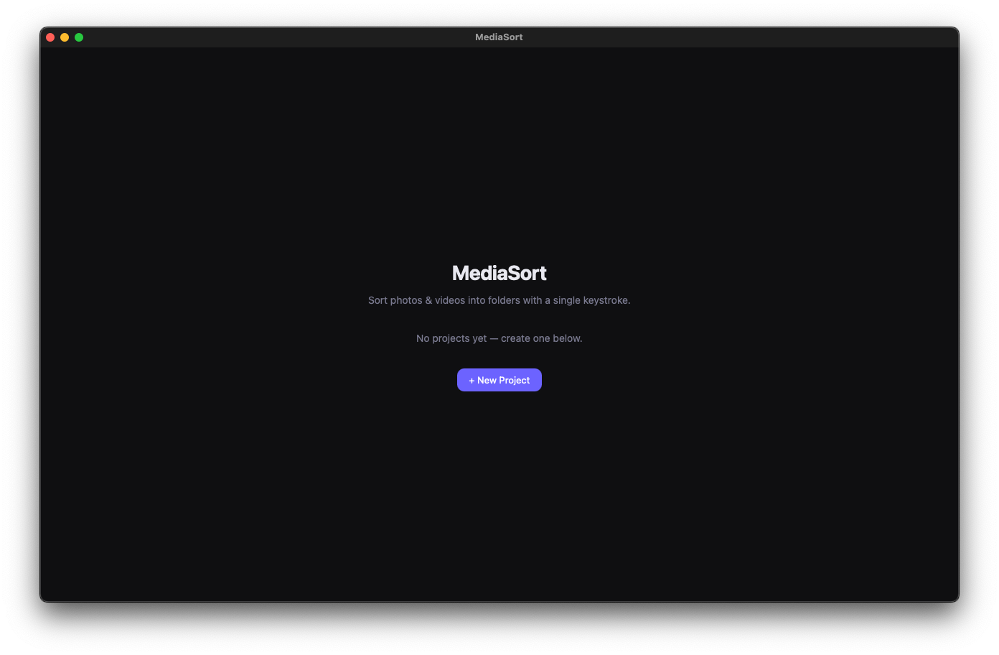
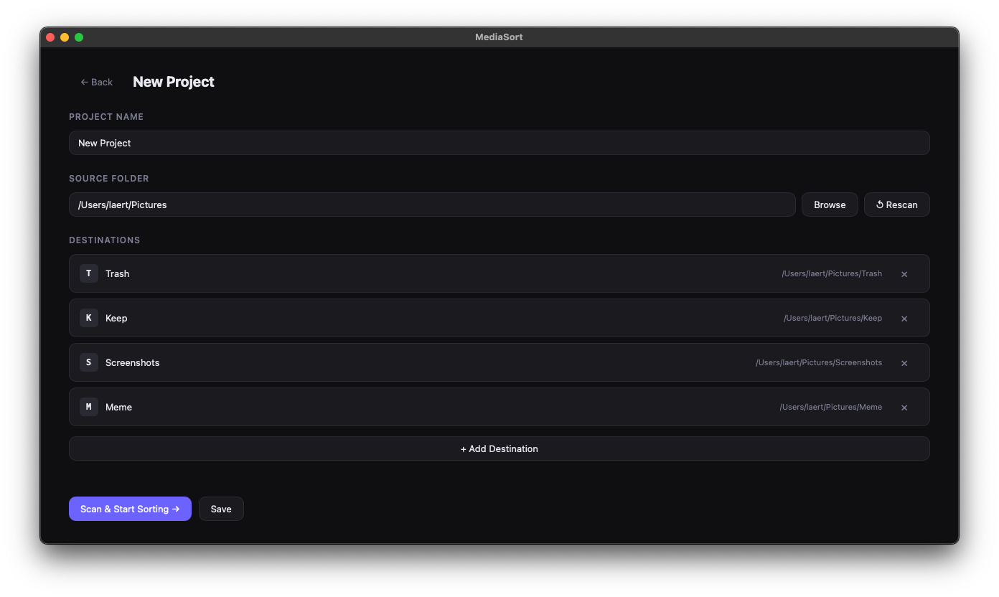
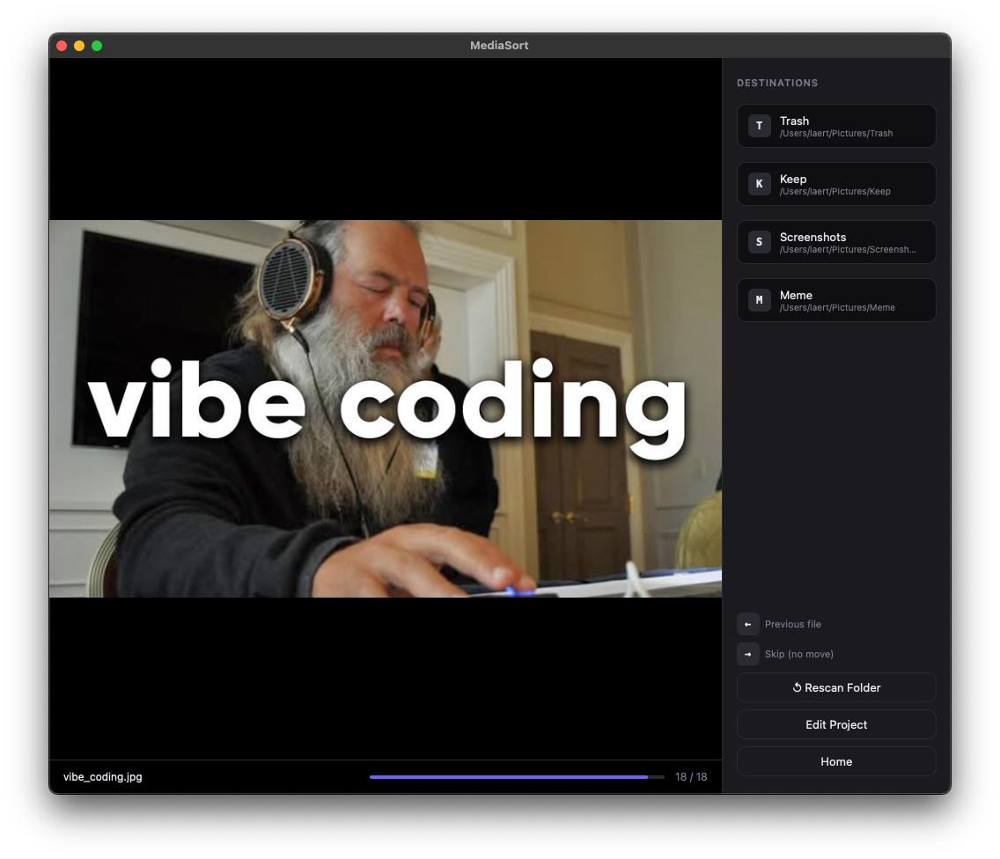

<p align="center">
  
</p>

<h1 align="center">MediaSort</h1>
<p align="center">
  Fast, keyboard-driven media sorting for photos, videos, and audio
</p>

---

##  Overview

MediaSort lets you quickly sort large collections of media using only your keyboard.

No dragging. No clicking. Just flow.

---

##  Screenshots

### Home


### Project Setup


### Sorting Mode


---

##  How It Works

1. **Create a Project**
   - Choose your source folder

2. **Scan Media**
   - All supported files are automatically detected

3. **Add Destinations**
   - Example: `Keep`, `Trash`, `Favorites`
   - Assign a key to each

4. **Start Sorting**
   - One file at a time, full focus

---
* Files are **moved**, not copied
* Undo is available for the last action
* Your projects are saved locally
---

##  Cu️stomize Keyboard Controls

| Key | Action |
|-----|--------|
| Assigned key (e.g. `E`) | Move file to destination |
| ← Arrow | Undo last move |
| → Arrow | Skip file |

---
-  Extremely fast workflow
- ️ Fully keyboard-driven
-  Minimal UI, maximum focus
-  Works with large media libraries

---

##  Supported Formats

### Images
jpg, jpeg, png, gif, webp, bmp, tiff, heic, heif, avif, svg, ico, raw, cr2, cr3, nef, arw, dng, orf, rw2  

### Video
mp4, mov, avi, mkv, webm, m4v, flv, wmv, mpg, mpeg, 3gp  

### Audio
mp3, m4a, wav, flac, ogg, aac  

---

##  Getting Started

Binary for MacOS available [here.](https://github.com/laerttt/mediasort/releases/tag/0.1.0)
```bash
npm install
npm run dev
````

---

##  Tech Stack

* Tauri 2
* Vanilla JavaScript
* Rust

---

